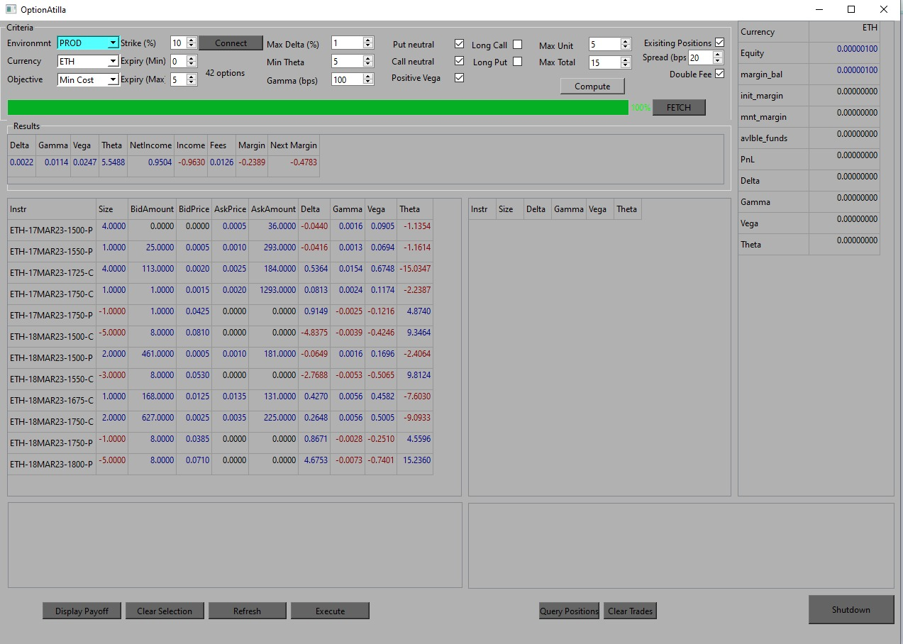

# Option Arbitrage on Deribit

This tool identifies opportunities in Deribit options with various parameterizations by constructing a portfolio of options that can be delta hedged to generate P/L. It should ideally be used across three option expiries.

1. Maximize Gamma with a threshold on cost of portfolio (hopefully sometimes you can find a zero cost long gamma portfolio).
2. Minimize Theta (hopefully sometimes you can find a portfolio with positive gamma and negative theta; earn theta and long gamma).
3. Minimize Cost (hopefully sometimes you can find a portfolio with postive gamma/negative theta at zero cost!)

